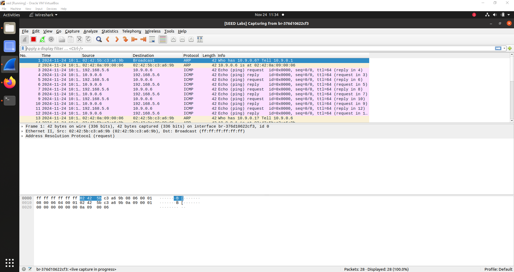
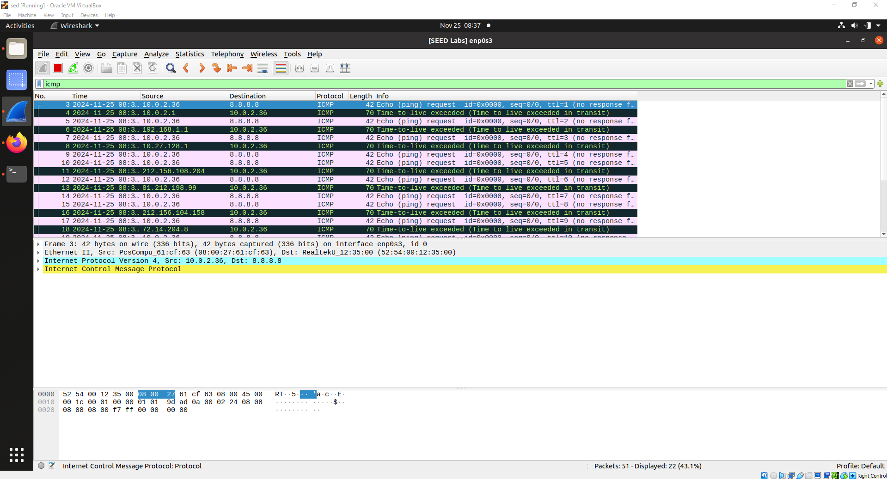
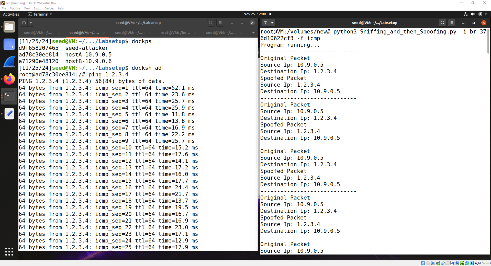
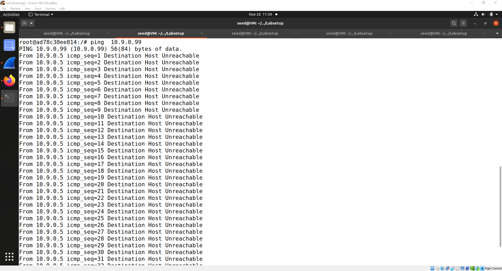
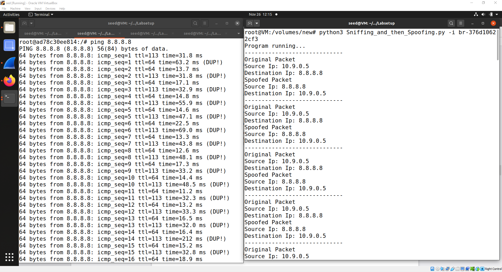
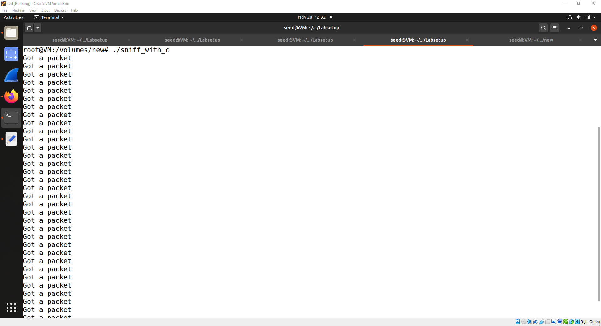

Tasks and instructions : [https://seedsecuritylabs.org/Labs_20.04/Files/Sniffing_Spoofing/Sniffing_Spoofing.pdf]

# Task 1

### Task 1.1: Sniffing Packets
Running sudo captured the package and printed the information inside. For example when pinging:
https://seedsecuritylabs.org/

    ###[ Ethernet ]###    dst       = 02:42:5b:c3:a6:9b   src       = 02:42:0a:09:00:06   type      = IPv4
    ###[ IP ]### 
         version   = 4
         ihl       = 5
         tos       = 0x0
         len       = 84
         id        = 10321
         flags     = DF
         frag      = 0
         ttl       = 64
         proto     = icmp
         chksum    = 0xe0e8
         src       = 10.9.0.6
         dst       = 185.199.109.153
         \options   \
    ###[ ICMP ]### 
            type      = echo-request
            code      = 0
            chksum    = 0x82
            id        = 0x29
            seq       = 0x1
    ###[ Raw ]### 
               load      = '\xd6)Cg\x00\x00\x00\x00\x12\xf0\x0c\x00\x00\x00\x00\x00\x10\x11\x12\x13\x14\x15\x16\x17\x18\x19\x1a\x1b\x1c\x1d\x1e\x1f !"#$%&\'()*+,-./01234567'
Scapy requires administrative (root) permissions to listen to packets on the network interface using raw sockets. If you run this code as a normal user, you will encounter this error.

    Traceback (most recent call last):
      File "snf.py", line 10, in <module>
        pkt = sniff(iface=iface[1], filter="icmp", prn=print_pkt)
      File "/usr/local/lib/python3.8/dist-packages/scapy/sendrecv.py", line 1036, in sniff
        sniffer._run(*args, **kwargs)
      File "/usr/local/lib/python3.8/dist-packages/scapy/sendrecv.py", line 906, in _run
        sniff_sockets[L2socket(type=ETH_P_ALL, iface=iface,
      File "/usr/local/lib/python3.8/dist-packages/scapy/arch/linux.py", line 398, in __init__
        self.ins = socket.socket(socket.AF_PACKET, socket.SOCK_RAW, socket.htons(type))  # noqa: E501
      File "/usr/lib/python3.8/socket.py", line 231, in __init__
        _socket.socket.__init__(self, family, type, proto, fileno)
    PermissionError: [Errno 1] Operation not permitted

### Task 1.1B.

Ref to the  [documentation](https://scapy.readthedocs.io/en/latest/usage.html#generating-sets-of-packets)  of module  `scapy`  and  [BPF syntax](https://biot.com/capstats/bpf.html), I can pass the following strings as argument  `filter`  in  `sniff`:

-   `proto icmp`  /  `icmp`
-   `tcp dst port 23 and src host x.x.x.x`
-   `net 128.230.0.0/16`
### Task 1.2: Spoofing ICMP Packets
[spoofing_icmp.py](https://github.com/HasanFiratKilic/Seedlab/blob/main/Packet-Sniffing-and-Spoofing/spoofing_icmp.py)

    from scapy.all import *
    import argparse
    import random
    import time
    
    def send_fake_icmp_packets(target_ip,source_ip, count):
    	for _ in range(count):
    		packet = IP(src=source_ip, dst=target_ip) / ICMP()
    		send(packet)
    		print(f"Sent packet from {source_ip} to {target_ip}")
    		time.sleep(1)  
    		
    def get_user_input():
    	parser = argparse.ArgumentParser()
    	parser.add_argument("-t","--target",dest="target",help="to set the destination ip")
    	parser.add_argument("-s","--source",dest="source",help="to set the source ip")
    	parser.add_argument("-c","--count",dest="count",type=int, default=10,help="to set the number of packets to send")
    	return parser.parse_args()
    	
    user_options = get_user_input()
    user_target = user_options.target
    user_source = user_options.source
    user_count = user_options.count		
    
    send_fake_icmp_packets(user_target,user_source, user_count)
-   Takes three arguments from the user:
    -   `-t` or `--target`: Destination IP address.
    -   `-s` or `--source`: Fake source IP address.
    -   `-c` or `--count`: The number of packets to send (10 by default).

To run this program, you can use a command like the following in the terminal:
`python3 Spoofing_ICMP.py -t 10.9.0.6 -s 192.168.5.6`
Output on wireshark:

### Task 1.3: Traceroute
[traceroutr.py](https://github.com/HasanFiratKilic/Seedlab/blob/main/Packet-Sniffing-and-Spoofing/traceroute.py)

    from scapy.all import *
    import argparse
    
    def argparse_input():
        parser = argparse.ArgumentParser()
        parser.add_argument("-t", "--target", dest="target", help="for Target IP address")
        return parser.parse_args()
    
    def traceroute(ip):
        print("Starting traceroute...")
        target_ip = IP(dst=ip)
        ttl = 1
    
        while True:
            target_ip.ttl = ttl
            icmp_packet = ICMP()
            packet = target_ip / icmp_packet
            reply_packet = sr1(packet, timeout=2, verbose=0)
    
            if reply_packet is None:
                print(f"{ttl} hops: No reply")
            elif reply_packet[ICMP].type == 0:  
                print(f"{ttl} hops: {reply_packet[IP].src} (Destination reached)")
                break
            else:
                print(f"{ttl} hops: {reply_packet[IP].src}")
    
            ttl += 1
    
    user_input = argparse_input()
    traceroute(user_input.target)

-   Takes three arguments from the user:
    -   `-t` or `--target`: Destination IP address.
when the code is run for 8.8.8.8.8(Google).

  Output on wireshark:

### Task 1.4: Sniffing and-then Spoofing
[Sniffing_and_then_Spoofing.py](https://github.com/HasanFiratKilic/Seedlab/blob/main/Packet-Sniffing-and-Spoofing/Sniffing_and_then_Spoofing.py)

    from scapy.all import *
    import argparse
    
    def user_inputs():
    	parser = argparse.ArgumentParser()
    	parser.add_argument("-i","--iface",dest="iface",help="to interface")
    	return parser.parse_args()
    
    def spoof_icmp_reply_packet(pkt):
        if pkt[ICMP].type == 8:
            
            spoof_ip_pkt = IP(src=pkt[IP].dst,dst=pkt[IP].src)
            spoof_icmp_pkt = ICMP(id=pkt[ICMP].id,seq=pkt[ICMP].seq,type=0)
            raw_data = pkt[Raw].load
            spoof_pkt = spoof_ip_pkt/spoof_icmp_pkt/raw_data
    
            send(spoof_pkt,verbose=0)
            
            print("-----------------------------")
            print("Original Packet")
            print(f"Source Ip: {pkt[IP].src}")
            print(f"Destination Ip: {pkt[IP].dst}")
            print(f"Spoofed Packet")
            print(f"Source Ip: {spoof_ip_pkt[IP].src}")
            print(f"Destination Ip: {spoof_ip_pkt[IP].dst}")
            
            
    user_options = user_inputs()
    user_iface = user_options.iface
    
    print("Program running...")
    pkt = sniff(filter="icmp",iface=user_iface,prn=spoof_icmp_reply_packet)
Run the program in the attack container. Then, from the machine `10.9.0.5`, execute the command `ping 1.2.3.4` to the unreachable IP address `1.2.3.4`. Now, `1.2.3.4` will be reachable.

10.9.0.99 If we ping 10.9.0.99 to a host that does not exist on the LAN, the output is:

If the device at 10.9.0.5 cannot learn the MAC address of 10.9.0.99 (if it is not in the ARP table), then the 'Destination Host Unreachable' message will be received. This occurs when there is no device with the IP address 10.9.0.99 on the network or when it does not respond to ARP requests.

If we make a ping request to a host available on the internet at the latest 8.8.8.8.8.
Output:

The 'DUP!' (duplicate) indication you see in the ping output shows that the same ICMP echo reply (ping response) has been received multiple times.
# Task 2

### Task 2.1: Writing Packet Sniffing Program

### Task 2.1A: Understanding How a Sniffer Works

#### Question 1.
First, it initializes a raw socket bound to the device (NIC) that is be listening to. Then, it compiles the advanced filter rule into a low-level language and sets them as the BPF filter on the socket. Finally, it calls a loop to listen on the socket and call `got_packet()` whenever capturing a filtered packet on the socket.
#### Question 2.
If you want to set a BPF filter on the socket, packets received from the network are copied to the kernel. To listen on the socket and capture packets, it is necessary to access and modify something in kernel space, which requires root privilege. With such privilege, run `sniff` will show a `Segmentation fault` error message.
#### Question 3.
Change the third argument in (Line 22,  [`sniff.c`](https://github.com/HasanFiratKilic/Seedlab/blob/main/Packet-Sniffing-and-Spoofing/sniff.c)

    handle = pcap_open_live("enp0s3", BUFSIZ, 1, 1000, errbuf);

If using a non-zero  `int`, the  _promiscuous mode_  is turned on. Otherwise, it is turned off. Keep the program run on the current VM.

Open another VM within the same subnet and use it to  `ping`  any host.

With promiscuous mode on, the program can capture packets of those  `echo`  requests above. Otherwise, it will get nothing even if  `ping`  runs properly. Promiscuous mode enables the program to sniff any packet coming into the NIC regardless of its actual destination host. So with it turned on, we can get packets sent among other computers.
### Task 2.1B
Change the  [`filter_exp[]`](https://github.com/HasanFiratKilic/Seedlab/blob/32f28d1f88631e99f7198aae41199187619526af/Packet-Sniffing-and-Spoofing/sniff.c#L13) or directly set the third argument of  [`pcap_compile()`](https://github.com/HasanFiratKilic/Seedlab/blob/32f28d1f88631e99f7198aae41199187619526af/Packet-Sniffing-and-Spoofing/sniff.c#L18) according to  BPF syntax.

-   `icmp and src host 10.0.2.4 and dst host 10.0.2.15`
-   `tcp portrange 10-100`
